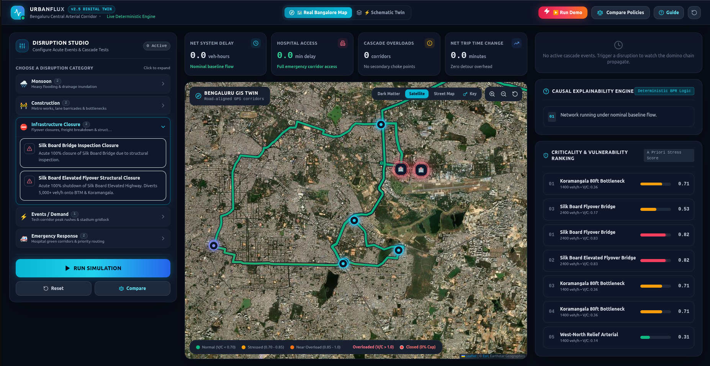
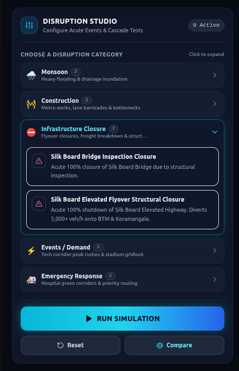
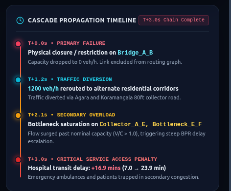
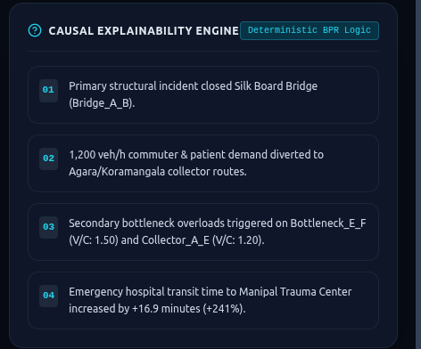
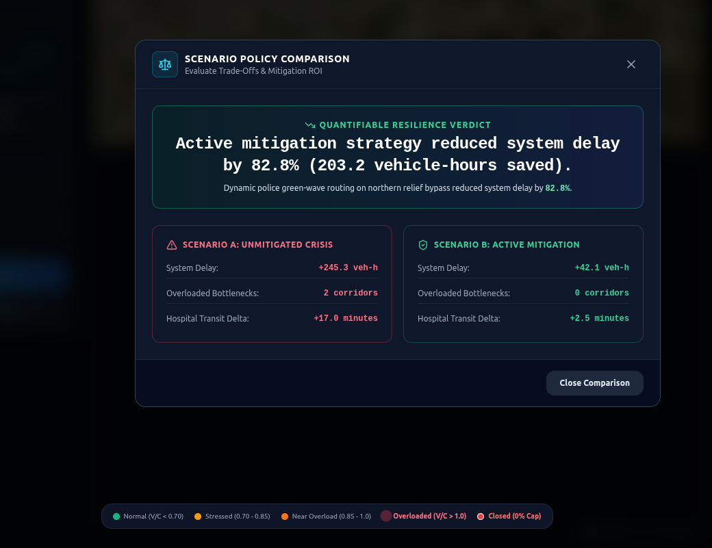

# UrbanFlux (UrbanResilience)

> **Deterministic Digital Twin & Cascading Infrastructure Disruption Simulator for Bengaluru**

UrbanFlux models multi-modal urban traffic cascades, critical facility access (Level-1 trauma centers, tech corridors, arterials), and evaluates dynamic disruption scenarios using deterministic network flow algorithms (Dijkstra, Bureau of Public Roads delay curves) and ML-backed empirical observations.

---

## 1. Executive Summary & Core Causal Cascade

Traditional navigation apps simply route drivers around closures without modeling systemic downstream consequences. UrbanFlux models the complete causal cascade chain:

$$\text{Primary Hazard} \longrightarrow \text{Capacity Reduction } (r) \longrightarrow \text{Commuter Diversion} \longrightarrow \text{Secondary Overload } (V/C > 1.0) \longrightarrow \text{Critical Service Delay}$$

When an acute shock occurs (e.g. Silk Board flyover shutdown or Bellandur ORR flash flood), traffic diverts onto secondary corridors that lack capacity, triggering cascading gridlock miles away from the initial incident and compromising emergency access to hospitals.

---

## 2. 🚀 Quickstart & Setup

### Step 1: Clone the Repository at the `backupbackup` branch
```bash
git clone -b backupbackup https://github.com/yam1-croissant/infrastructure-cascading.git
cd infrastructure-cascading
```

### Step 2: Install Dependencies
```bash
# Python dependencies
pip install -r requirements.txt

# Frontend dependencies
cd frontend && npm install && cd ..
```

---

### Step 3: Run on 2 Separate Terminals

#### Terminal 1 (Backend API Server):
```bash
uvicorn backend.main:app --host 0.0.0.0 --port 8000 --reload
```
- **Interactive Swagger Docs**: [http://localhost:8000/docs](http://localhost:8000/docs)
- **API Health Check**: [http://localhost:8000/health](http://localhost:8000/health)

#### Terminal 2 (Frontend Interface):
```bash
npm --prefix frontend run dev
```

#### Finally open in your browser:
👉 **[http://localhost:5173/](http://localhost:5173/)**

---

## 3. 🐳 Alternative: Quickstart with Docker

If you prefer running everything in containerized mode:

```bash
docker compose up --build
```

- **Frontend App**: [http://localhost:3000](http://localhost:3000)
- **Backend API & Docs**: [http://localhost:8000/docs](http://localhost:8000/docs)

For live-reloading during development:
```bash
docker compose -f docker-compose.dev.yml up
```

---

## 4. 🖥️ Visual Interface Tour

### 4.1 Digital Twin Overview


- **Header Navigation Bar**: Live simulation status (`● SIMULATION ACTIVE`), mode switcher between **Real Bengaluru Map** and **Schematic Twin**, the **Compare Policies** modal, and the interactive **Guide**.
- **Top Impact Metrics**: Real-time KPIs summarizing network damage:
  - **Net System Delay**: Total commuter vehicle-hours lost (e.g., `+387.8 veh-hours`).
  - **Hospital Access Delay**: Travel time degradation to emergency trauma centers (e.g., Manipal Hospital transit jumping from `6.8 min → 24.4 min`).
  - **Cascade Overloads**: Count of secondary bottleneck corridors breaching physical capacity ($V/C > 1.0$).
  - **Net Trip Time Change**: Average percentage increase in commuter travel duration.
- **Bird's-Eye Map Canvas**: Dark-mode geographic rendering of key corridors (Silk Board, Koramangala, Indiranagar, Domlur, Whitefield).

---

### 4.2 Disruption Studio & Link Inspector


The **Disruption Studio** allows city planners and emergency managers to simulate realistic disruption shocks:
- 🌧️ **Monsoon & Flooding**: Flash floods, canal breaches, and underpass waterlogging (e.g., *Bellandur ORR & Sarjapur Flash Flood*).
- 🚧 **Construction & Roadwork**: Metro Phase 3 barricades, pipeline excavations, and utility lane reductions.
- ⛔ **Infrastructure Closure**: Emergency structural inspections or bridge shutdowns (e.g., *Silk Board Elevated Flyover 100% Closure*).
- ⚡ **Events & Peak Demand**: Tech corridor morning rushes, commercial summits, and stadium event surges.
- 🚑 **Emergency Response**: Hospital green-corridors, traffic warden deployment, and signal priority routing.

**Interactive Link Inspector**:
1. Click any road segment on the map or schematic to inspect nominal capacity, free-flow speed, baseline flow, and current $V/C$ stress.
2. Drag the capacity multiplier from `1.00` down to `0.00` (complete physical closure), or use quick presets (`100% Closed`, `50% Waterlog`, `25% Barricade`, `Reset Link`).
3. Click **"Run Simulation Engine"** to recalculate traffic flows and cascade propagation.

---

### 4.3 Cascading Failure Dynamics


#### The 4 Propagation Stages:
1. **Stage 1 — Primary Incident ($t = 0\text{ min}$)**: Primary link capacity drops to zero ($C_{\text{eff}} = 0$); routing weight explodes to $\infty$.
2. **Stage 2 — Demand Diversion ($t = 5\text{ min}$)**: Displaced commuter and patient volume (e.g. 1,800 veh/hr) detours onto secondary corridors (*Cambridge Layout Collector* and *Domlur Canal Road*).
3. **Stage 3 — Secondary Bottleneck Overload ($t = 15\text{ min}$)**: The narrow 2-lane bottleneck experiences an assigned volume surge from 500 to 2,300 veh/hr ($V/C$ jumps from $0.36 \to 1.64$), creating severe secondary gridlock miles away.
4. **Stage 4 — Critical Asset Degradation ($t = 30\text{ min}$)**: Emergency ambulance transit time to *Manipal Level-1 Trauma Center* surges by **+17.5 minutes (+256%)**, breaching the critical 15-minute emergency survival window.

---

### 4.4 AI Causal Explainability & Criticality Rankings


- **The "Why Did This Happen?" Engine**: Generates plain-English, deterministic causal narratives explaining exact root causes, diversion routes, bottleneck overloads, and hospital delays.
- **System Criticality Rankings**: Scores and ranks corridors combining **betweenness centrality**, **flow load**, and **emergency access priority**:

| Rank | Link ID | Facility Name | Vulnerability | Operational Role |
|:---:|---|---|:---:|---|
| **#1** | `Bridge_A_B` | Silk Board Elevated Flyover | **0.96** | Primary arterial spine connecting south suburbs to IT corridors |
| **#2** | `Bottleneck_E_F` | Domlur Canal Narrow Bottleneck | **0.91** | Narrow 2-lane bottleneck absorbing 85% of diverted flow |
| **#3** | `Arterial_B_C` | Old Airport Hospital Approach | **0.85** | Primary life-safety access corridor to Manipal Trauma Center |
| **#4** | `Collector_A_E` | Agara Bypass Collector | **0.78** | Secondary collector surging into overload during flyover closures |
| **#5** | `Connector_G_C` | Indiranagar Emergency Link | **0.62** | Under-utilized alternate relief corridor for active mitigation |

---

### 4.5 Policy Mitigation & Scenario Comparison


Planners can evaluate proposed interventions side-by-side before ground deployment:
- **Scenario A (Unmitigated Closure)**: Silk Board closes with no active traffic control $\to$ **+413.9 veh-hrs lost**, 2 overloaded bottlenecks ($V/C = 1.64$), **+17.5 min hospital delay**.
- **Scenario B (Active Police Mitigation)**: Traffic wardens deploy to northern relief corridor (*Connector_A_G*) with signal green-waves $\to$ **+70.7 veh-hrs lost (82.9% delay reduction)**, **0 overloaded bottlenecks**, **8.2 min hospital response (93% delay recovery)**.

---

## 5. 🔬 Mathematical Model & BPR Formulation

Congested travel time on link $e$ follows the Bureau of Public Roads (BPR) delay formulation:

$$t_e(V_e, C_e) = t_{0,e} \left[ 1 + \alpha \left( \frac{V_e}{C_e} \right)^\beta \right]$$

- $t_{0,e}$: Free-flow travel time (length / free-flow speed).
- $V_e$: Assigned traffic volume (veh/hr).
- $C_e = C_{\text{nominal}, e} \times r_e$: Effective capacity under disruption multiplier $r_e \in [0.0, 1.0]$.
- $\alpha = 0.15, \beta = 4.0$: Standard calibration parameters.
- When $V_e > C_e$, delay grows exponentially with power $\beta = 4.0$, accurately capturing gridlock breakdown.

---

## 6. 📦 Architecture Overview

```
                 ┌─────────────────────────────┐
                 │        User Browser         │
                 │    http://localhost:5173    │
                 └──────────────┬──────────────┘
                                │
                                │ HTTP / JSON API
                                │
                 ┌──────────────▼──────────────┐
                 │      urbanflux-backend      │
                 │        FastAPI (8000)       │
                 ├─────────────────────────────┤
                 │  - Network Simulation Core  │
                 │  - Dijkstra All-Pairs Engine│
                 │  - BPR Delay & Overloads    │
                 │  - Criticality Scoring      │
                 │  - Causal Reasoner Engine   │
                 └─────────────────────────────┘
```

---

## 7. 🧪 Testing & Verification

Run the automated test suite and standalone demos:

```bash
# Full automated test suite (66 tests)
pytest tests/ -v

# Standalone Traffic Math Demo
python3 examples/traffic_math_demo.py

# Standalone Network Disruption Demo
python3 examples/network_disruption_demo.py
```

---

## 8. 📁 Repository File Map

| Category | File | Description |
|---|---|---|
| **Overview & Guide** | [`README.md`](README.md) | Combined project documentation & user manual |
| **User Guide** | [`docs/USER_GUIDE.md`](docs/USER_GUIDE.md) | Operational user manual with screenshots |
| **API Contract** | [`docs/api.md`](docs/api.md) | Formal REST API schema and endpoint documentation |
| **Domain Model** | [`docs/FINAL_DOMAIN_MODEL.md`](docs/FINAL_DOMAIN_MODEL.md) | Theoretical foundation and domain architecture |
| **Backend App** | [`backend/main.py`](backend/main.py) | FastAPI digital twin server and simulation endpoints |
| **Simulation Core** | [`src/simulation/`](src/simulation/) | Mathematical BPR formulation, graph models, and routing |
| **Frontend UI** | [`frontend/`](frontend/) | React 18 + Leaflet digital twin web application |
